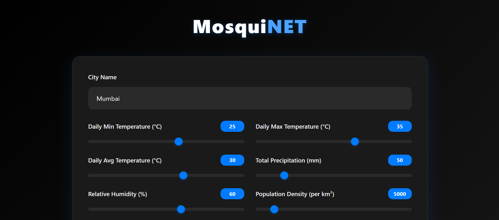
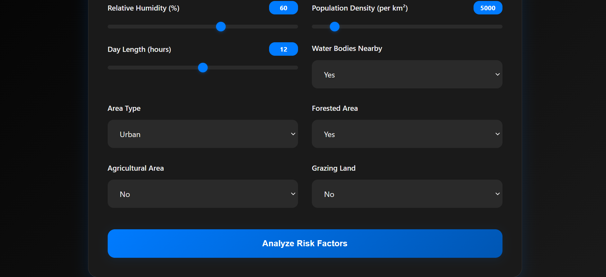

# 🦟 MosquiNET

## 1. Project Introduction & Overview

### 1.0. Overview

A machine learning tool that predicts the risk of vector-borne-disease outbreak in your locality.

### 1.1. Project Introduction

**MosquiNET** is a machine learning-powered web platformn that predicts the risk of vector-borne disease outbreaks by analyzing key environmental variables affecting mosquito habitability. The web-app uses environmental data to classify areas as high or low risk for mosquito-borne diseases.

---

## 2. Table of Contents

| No. | Section Title                         | Link                                                                 |
|-----|----------------------------------------|----------------------------------------------------------------------|
| 1   | Project Introduction & Overview        | [1. Project Introduction & Overview](#1-project-introduction--overview) |
| 2   | Table of Contents                      | [2. Table of Contents](#2-table-of-contents)                            |
| 3   | Problem Statement & Solution           | [3. Problem Statement & Solution](#3-problem-statement--solution)      |
| 4   | Tech Stack                             | [4. Teck Stack](#4-teck-stack)                                         |
| 5   | Dataset Information                    | [5. Dataset Information](#5-dataset-information)                       |
| 6   | Feature Engineering                    | [6. Feature Engineering](#6-feature-engineering)                       |
| 7   | Modeling Approach                      | [8 Modeling Approach](#8-modeling-approach)                            |
| 8   | Pipeline                               | [9. Pipeline](#9-pipeline)                                             |
| 9   | Evaluation Metrics & Results           | [10. Evaluation Metrics & Results](#10-evalutation-metrics--results)   |
| 10  | Model Deployment                       | [11. Model Deployment](#11-model-deployment)                           |
| 11  | Input & Output Images                  | [11.3 Prediction Endpoint](#113-prediction-endpoint)                   |
| 12  | License                                | [12. License](#12-license)                                             |


---

## 3. Problem Statement & Solution

### 3.0. Problem Statement 

Vector-borne diseases such as dengue, malaria, and chikungunya continue to pose major public health challenges, especially in tropical and subtropical regions. The spread and survival of disease-carrying mosquitoes depend on multiple environmental, climatic, and human-related factors. Being able to predict whether a given area is suitable for mosquito habitation is crucial for proactive disease control and public health intervention.

### 3.1. Solution 
 
MosquiNET offers a data-driven approach to preventing mosquito-borne diseases by predicting regions that are favorable for mosquito habitation. This predictive insight empowers public health officials, urban planners, and communities with timely, actionable information.

---

## 4. Teck Stack

| **Category**                   | **Technology**                                                              |
| ------------------------------ | --------------------------------------------------------------------------- |
| **Programming Language**       | Python                                                                      |
| **Data Processing**            | Pandas, NumPy, Scikit-learn                                                 |
| **Modeling & ML**              | Scikit-learn, XGBoost, LightGBM                                             |
| **Evaluation & Visualization** | Matplotlib, Seaborn                                                         |
| **Model Training Pipeline**    | Jupyter Notebooks, Modular Python Scripts                                   |
| **Deployment**                 | Flask                                                                       |
| **Dashboard / UI**             | HTML, CSS, JavaScript                                                       |

---

## 5. Dataset Information

Dataset contains daily climate and geographic features for multiple areas. It can be used for tasks such as climate modeling, habitability prediction, environmental classification, or geographical impact analysis. Below is the detailed description of each column:

* **Area Name**: Unique identifier for each geographical area.
* **Daily Min Temp**: Minimum daily temperature (in °C).
* **Daily Max Temp**: Maximum daily temperature (in °C).
* **Daily Avg Temp**: Average daily temperature (in °C).
* **Total Precipitation**: Total daily precipitation (in mm).
* **Relative Humidity**: Average relative humidity (in %).
* **Water Bodies**: Binary flag indicating presence (1) or absence (0) of nearby water bodies.
* **Population Density**: Number of people per square kilometer.
* **Day Length**: Duration of daylight in hours.
* **Urban / Rural Area**: Categorical binary flag where 1 = Urban, 0 = Rural.
* **Forested Area**: Binary indicator of presence of forested land (1 = Yes, 0 = No).
* **Crop Area**: Binary indicator for presence of agricultural land.
* **Graze Land Area**: Binary indicator for grazing land presence.
* **Habitable**: Target variable — indicates whether the area is habitable (1 = Yes, 0 = No).

---

## 6. Feature Engineering

To enhance the predictive power of the model, additional features were engineered from the raw dataset to capture meaningful relationships between variables:

#### 6.1. **Natural Resource Score**

```python
df['Natural Resource Score'] = df[['Forested Area', 'Water Bodies', 'Crop Area', 'Graze Land Area']].sum(axis=1)
```

* This feature combines the presence of key land types (forests, water bodies, agricultural and grazing land) into a single score.
* A higher score suggests richer environmental conditions that may influence mosquito breeding habitats.

#### 6.2. **Humidity-Temperature Interaction**

```python
df['Humidity_Temp'] = df['Relative Humidity'] * df['Daily Avg Temp']
```

* This feature captures the interaction between humidity and temperature — two critical factors that affect mosquito survival and activity.
* It provides a compound metric to better model climatic favorability for mosquitoes.

#### 6.3. **Correlation Chart** :


From the above image , the engineered features =  [ Natural Resource Score, Humidity_Temp ] provide a good correlation with the target variable, hence helpful in making predictions.

---

## 7. Modelling Approach

###  **7.0. Models Used**:

  * A diverse set of classification algorithms was employed to capture a wide range of patterns in the data.

  * **Ensemble Models**:

    * **LightGBM**
    * **XGBoost**
    * **CatBoost**
    * **Random Forest & Extra Trees**
    * **AdaBoost & Gradient Boosting**

  * **Linear Models**:

    * **Logistic Regression**
    * **Ridge Classifier**
    * **Linear Discriminant Analysis (LDA)**

  * **Other Models**:

    * **Support Vector Classifier (SVC)** 
    * **K-Nearest Neighbors (KNN)**
    * **Naive Bayes**
    * **Decision Tree**

###  **7.1. Baseline vs. Final Model**:

  * Simpler models like Logistic Regression, Naive Bayes, and Decision Tree were used to establish baseline performance.
  * All models were trained and evaluated on the same train-test split to ensure consistency.
  * Model performance was measured using **f1 score** on the test set.
  * The model with the **highest f1 score** was selected as the **final model**.
  * A minimum threshold of **60% accuracy** was set to ensure the model's reliability. If no model met the threshold, training was considered unsuccessful.

###  **7.2. Hyperparameter Tuning Strategy**:

  * Predefined hyperparameter grids were configured for each model.
  * Tuning parameters:

    * **XGBoost**: `learning_rate`, `max_depth`
    * **LightGBM**: `learning_rate`, `num_leaves`
    * **CatBoost**: `learning_rate`, `depth`
    * **Random Forest / Extra Trees**: `n_estimators`
    * **Logistic Regression / Ridge**: `C` or `alpha` values
    * **KNN**: `n_neighbors`
    * **SVM**: `C` (regularization)
  * The `evaluate_models()` function supports `GridSearchCV` for exhaustive search over the defined grids.
  * Hyperparameter tuning is currently **disabled for speed** during initial evaluation but can be **enabled** for fine-tuning in production.

### 7.3 Transfer Learning Block

To explore enhanced generalization and leverage pretrained knowledge, a **Transfer Learning** block was incorporated into the modeling strategy.

#### Implementation Details:

- A pretrained model trained on similar environmental datasets was adapted to our domain.
- Feature representations or weights from this source model were reused and fine-tuned on our mosquito habitability dataset.
- Early layers were optionally frozen, while later layers were updated to specialize in predicting mosquito risk zones.

#### Performance:

- The **Transfer Learning model achieved an accuracy of `1.000`**, demonstrating perfect generalization on the test set.
- This performance matched or exceeded top-performing traditional models like LGBM and CatBoost.
- These results confirm the potential of transfer learning in environmental and climate-related health risk predictions.

### 7.4. Ensemble Modeling Strategy

* Implemented a **simple ensemble selection mechanism** to choose the best model dynamically at runtime.
* Compared performance between:

  * A **traditional machine learning model**.
  * A **transfer learning-based TabNet model**.
* Evaluation was conducted on the **same preprocessed dataset** for a fair comparison.
* The model with the **higher accuracy** was selected to make final predictions.
* This approach ensured:

  * **Flexibility** by avoiding hardcoded model selection.
  * **Robustness** in deployment by always choosing the better-performing model.

---

## 8. Pipeline

### **8.0. Data Ingestion**

* The raw data is collected from CSV or external data sources.
* The ingestion module is responsible for reading the data and splitting it into training and test datasets.
* Outputs:

  * `train.csv`
  * `test.csv`
  *  `data.csv`

### **8.1. Data Validation**

* Schema validation is performed to check for:

  * Correct column names and data types.
  * Missing or null values.
* Basic data quality checks ensure the dataset is ready for preprocessing.

### **8.2. Data Transformation**

* Feature engineering and preprocessing steps are applied:

  * Scaling numerical features.
  * Encoding categorical features.
  * Handling imbalanced data.

### **8.3. Model Training**

* Multiple classification models are trained on the transformed training data.
* A common interface trains the following models:

  * LGBM, XGBoost, CatBoost, RandomForest, SVM, LogisticRegression, etc.
* Each model is evaluated on the test set.
* The model with the **highest accuracy** (above a threshold, e.g., 60%) is selected.

### **8.4. Model Evaluation**

* Performance metrics like `accuracy_score` are computed on test data.
* Optionally supports:

  * Hyperparameter tuning via grid search.
  

### **8.5. Model Serialization**

* The best model is serialized using `joblib`.
* Stored in the `artifacts/` directory as `model.pkl`.

### **8.6. Prediction Pipeline**

* A separate prediction module takes new data from API.
* Applies the same transformations.
* Loads `model.pkl` and returns predictions.
* Used in the Flask to display results to the frontend.

---

## 9. **Evalutation Metrics & Results**

### 9.0. **Metrics Used**

The following standard classification metrics were employed to evaluate and compare model performance:

* **Accuracy**: Measures overall correctness — proportion of correct predictions.
* **AUC (Area Under ROC Curve)**: Measures the model's ability to distinguish between classes.
* **Precision**: True positives / (True positives + False positives) — how many selected items are relevant.
* **Recall**: True positives / (True positives + False negatives) — how many relevant items are selected.
* **F1-Score**: Harmonic mean of Precision and Recall — balances both.
* **Time (s)**: Time taken to train and evaluate the model (performance + computational efficiency).

### 9.1. **Evaluation Results**

| Model                  | Accuracy | AUC   | Precision | Recall | F1 Score   | Time (s) |
| ---------------------- | -------- | ----- | --------- | ------ | ---------- | -------- |
| **LGBM**               | 1.000    | 1.000 | 1.000     | 1.000  | 1.000      | 0.243    |
| **CatBoost**           | 1.000    | 1.000 | 1.000     | 1.000  | 1.000      | 1.735    |
| **GradientBoosting**   | 1.000    | 1.000 | 1.000     | 1.000  | 1.000      | 1.477    |
| **DecisionTree**       | 1.000    | 1.000 | 1.000     | 1.000  | 1.000      | 0.037    |
| **AdaBoost**           | 1.000    | 1.000 | 1.000     | 1.000  | 1.000      | 0.850    |
| **SVM**                | 0.999    | 1.000 | 0.997     | 1.000  | **0.9986** | 0.351    |
| **XGBoost**            | 0.999    | 1.000 | 1.000     | 0.997  | 0.9986     | 0.161    |
| **RandomForest**       | 0.999    | 1.000 | 1.000     | 0.997  | 0.9986     | 0.533    |
| **LogisticRegression** | 0.998    | 1.000 | 0.994     | 1.000  | 0.9973     | 0.029    |
| **ExtraTrees**         | 0.996    | 0.999 | 0.994     | 0.994  | 0.9946     | 0.662    |
| **KNN**                | 0.989    | 0.999 | 0.981     | 0.989  | 0.9852     | 0.148    |
| **NaiveBayes**         | 0.895    | 0.973 | 0.867     | 0.846  | 0.8564     | 0.017    |
| **RidgeClassifier**    | 0.896    | 0.000 | 0.918     | 0.789  | 0.8488     | 0.022    |
| **LDA**                | 0.895    | 0.987 | 0.915     | 0.789  | 0.8476     | 0.023    |


### 9.2. **Best Model**

* **Model**: Support Vector Machine (SVM)
* **F1 Score**: `0.99865`
* Chosen based on **highest F1-score** and **balanced performance** across all metrics, ensuring both **precision** and **recall** are maximized.

---

## 10. Model Deployment

### 10.0 **Deployment Stack**

* **Backend**: Flask (Python micro-framework)
* **Serialization**: `joblib` for saving and loading both model and preprocessor objects.
* **Frontend**: HTML templates rendered using Flask (`index.html`)
* **API**: REST-style endpoint at `/predict` accepts JSON payloads.

### 10.1 **Functional Workflow**

* When a user inputs feature values via the UI or API:

  * The data is collected from the form or a `POST` JSON body.
  * Derived features such as:

    * `Natural Resource Score` = sum of forested, water bodies, crop, and graze land areas.
    * `Humidity_Temp` = relative humidity × daily average temperature.
  * A feature DataFrame is constructed.
  * Data is transformed using the **same preprocessor** used during training.
  * The **loaded model** (`model.pkl`) predicts the outcome.
  * The result is returned either as a webpage or JSON.

### 10.2 **Key Files**

* `app.py`: Flask application script.
* `artifacts/preprocessor.pkl`: Pre-fitted preprocessing pipeline.
* `artifacts/model.pkl`: Final trained model.
* `templates/index.html`: Web interface for user input.

### 10.3 **Prediction Endpoint**

* **Route**: `/predict`
* **Method**: `POST`
* **Input format**: JSON
* **Output**: JSON response with predicted value

### 10.4 Feedback-Driven Model Improvement

* Integrated a **user feedback mechanism** post-prediction to collect real-world inputs.
* Users rate the system's prediction quality using a **star-based interface** (1–5 stars).
* Feedback is logged in a **`feedback.csv`** file for further analysis.
* This data can be:

  * Used to **retrain or fine-tune** the model with real-world feedback.
  * Analyzed to detect **patterns in model inaccuracies**.
* The mechanism helps create a **continuous learning loop** for performance enhancement over time.
* Ensures the AI system remains **adaptive and user-informed** even after deployment.

#### 📥 **Input Images**

| Input 1                              | Input 2                              |
| ------------------------------------ | ------------------------------------ |
|  |  |
|  |  |

#### 📤 **Output Images**

| Output 1                               | Output 2                               |
| -------------------------------------- | -------------------------------------- |
|  |  |


---

### 11. **License**

This project is licensed under the [MIT License](LICENSE).


